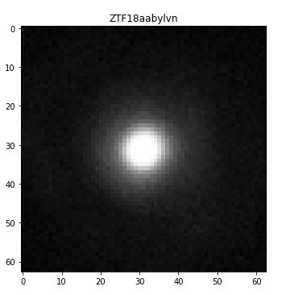
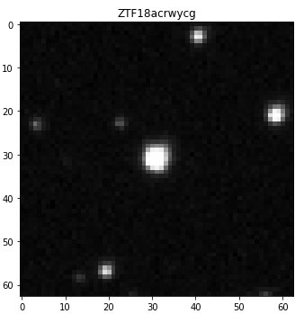
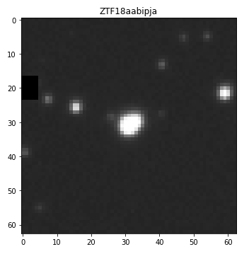

# Image Classification

This module perform a classification of alerts based on image visual content. It use only the cutoutScience image and return a single string label which describe image alert. 

# Procedure

The image classification perform in three steps :
* Filter images that are noised and/or corrupted (corrupted image contains Nan based on python definition of Nan)

* All images that are not noised and not corrupted are binarize with a threshold computed by triangle_thershold method from scikit_image library
then binary image which contains only small region are categorize as star else they go to the third step

* Final step use chan_vese algorithm to segment images and produce again a binary image. 
All binary image which contains at least one large region will be categorize as extend, the other will be categorize as star.

# Added values

This module adds one new columns for ZTF data:

| labels  |
|---------|
| str     |

The labels added by the classification are 'safe_noised', 'corrupted_noised', 'corrupted_clear', 'safe_clear_star', 'safe_clear_extend'

# Classification Example

|  image classified as extend      |    image classified as star    |   image classified as corrupted      |    image classified as noised        |
|----------------------------------|--------------------------------|--------------------------------------|--------------------------------------|  
| | |   |       |

# Limitation and future upgrades

* Currently, the alerts labelised as corrupted and noised are ignore by the classifier
* The classification is based on the size of segmented region, no information is provided for the shape of the object
* The noise measure used during the process is not well documented
* A significant number of false positive can passed the classification. They include especially close variable stars or object observed when the PSF are quite large.

